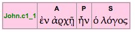
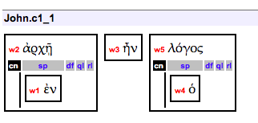

# Combined Annotation Format for Original OpenText.org (v0.11) XML Annotation

* The XML files in this repo are an experimental format that combines the three levels from 
the original annotation XML (1. base, 2. word group and 3. clause) into a single XML file for each chapter of 
the New Testament.

* The **clause** is the organizing unit and within each `<clause>` element the annotation from the three levels
are included. 
	* The `<w>` (word) elements from the base annotation contained in the clause are included as children of the
`<clause>` element. 
	* Then there is a `<wordgroup_level>` element that contains the appropriate word groups (`<wgroup>` elements)
          from the word group level annotation.
	* Finally there is a `<clause_level>` element that has the clause level annotation elements.


```
<clause>

	<clause_level>
		<!-- clause component elements, e.g. <S>, <P>, <C> etc -->
		<!-- word elements use the word id and internal references, e.g. <w ref="NT.Phlm.w11"/> -->
	</clause_level>

	<wordgroup_level>
		<!-- a series of <wgroup> elements with the nested wordgroup relations
		<!-- word elements use the word id and internal references, e.g. <w ref="NT.Phlm.w11"/> -->
	</wordgroup_level>

	<w>
		<pos/>
		<wf/>
		<sem/>
	</w>
	
	<!- all the words in clause -->

</clause>
```

* This is an example of the first clause in John 1:

	* Clause display
	

	* Word group display
	

* This is the XML for the combined format:

```
<chapter xmlns:xlink="http://www.w3.org/1999/xlink" book="John" num="1">
  <clause xml:id="NT.John.1_c1" level="primary" structure="A-P-S">
    <clause_level>
      <A>
        <w ref="NT.Joh.w1"/>
        <w ref="NT.Joh.w2"/>
      </A>
      <P>
        <w ref="NT.Joh.w3"/>
      </P>
      <S>
        <w ref="NT.Joh.w4"/>
        <w ref="NT.Joh.w5"/>
      </S>
    </clause_level>
    <wordgroup_level>
      <wgroup xml:id="NT.Joh.1_wg1">
        <head>
          <w ref="NT.Joh.w2">
            <modifiers>
              <specifier>
                <w ref="NT.Joh.w1"/>
              </specifier>
            </modifiers>
          </w>
        </head>
      </wgroup>
      <wgroup xml:id="NT.Joh.1_wg2">
        <head>
          <w ref="NT.Joh.w3"/>
        </head>
      </wgroup>
      <wgroup xml:id="NT.Joh.1_wg3">
        <head>
          <w ref="NT.Joh.w5">
            <modifiers>
              <specifier>
                <w ref="NT.Joh.w4"/>
              </specifier>
            </modifiers>
          </w>
        </head>
      </wgroup>
    </wordgroup_level>
    <w xml:id="NT.Joh.w1" ref="NT.John.1.1">
      <pos>
        <PRP/>
      </pos>
      <wf betaLex="e)n" lex="ἐν"></wf>
      <sem>
        <domain majorNum="83" subNum="13 9 47 23"/>
        <domain majorNum="13" subNum="8"/>
        <domain majorNum="84" subNum="22"/>
        <domain majorNum="89" subNum="119 80 84 5 141 76 26 48"/>
        <domain majorNum="90" subNum="10 56 56 6 30 23"/>
        <domain majorNum="67" subNum="33 136"/>
      </sem>
    </w>
    <w xml:id="NT.Joh.w2" ref="NT.John.1.1">
      <pos>
        <NON num="sing" cas="dat" gen="fem"/>
      </pos>
      <wf betaLex="a)rxh/" lex="ἀρχή"></wf>
      <sem>
        <domain majorNum="68" subNum="1"/>
        <domain majorNum="67" subNum="95"/>
        <domain majorNum="89" subNum="16"/>
        <domain majorNum="37" subNum="55 56"/>
        <domain majorNum="12" subNum="44"/>
        <domain majorNum="58" subNum="20"/>
        <domain majorNum="79" subNum="106"/>
      </sem>
    </w>
    <w xml:id="NT.Joh.w3" ref="NT.John.1.1">
      <pos>
        <VBF augment="-" num="sing" per="3rd" mod="ind"/>
      </pos>
      <wf betaLex="ei)mi/" lex="εἰμί"></wf>
      <sem>
        <domain majorNum="13" subNum="1 4 69 104"/>
        <domain majorNum="85" subNum="1"/>
        <domain majorNum="71" subNum="1"/>
        <domain majorNum="58" subNum="67 68"/>
      </sem>
    </w>
    <w xml:id="NT.Joh.w4" ref="NT.John.1.1">
      <pos>
        <ART num="sing" cas="nom" gen="mas"/>
      </pos>
      <wf betaLex="o(" lex="ὁ"></wf>
      <sem>
        <domain majorNum="92" subNum="24"/>
      </sem>
    </w>
    <w xml:id="NT.Joh.w5" ref="NT.John.1.1">
      <pos>
        <NON num="sing" cas="nom" gen="mas"/>
      </pos>
      <wf betaLex="lo/gos" lex="λόγος"></wf>
      <sem>
        <domain majorNum="33" subNum="98 99 260 51 100"/>
        <domain majorNum="57" subNum="228"/>
      </sem>
    </w>
  </clause>


...
```


